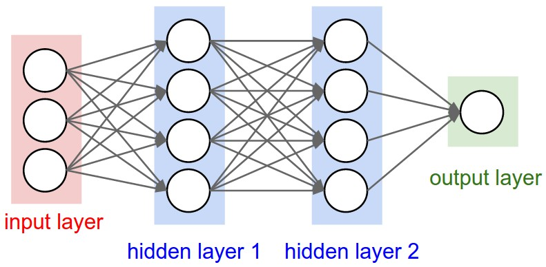
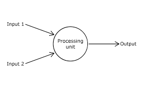

#  **인공지능**

GPU의 도입으로 신속하고 강력한 병렬 처리 성능이 향상돼 인공지능의 성장세가 가팔라졌다.

모든 영역의 데이터가 넘쳐나면서 빅데이터가 인공지능의 성장세에 큰 영향을 주고 있다.

## **관련 라이브러리**

### **텐서플로(Tensorflow)**

턴서플로는 머신 러닝 작업 속도를 크게 높여준다. 기본적으로 파이썬은 GIL 때문에 하나의 코어만 활용가능하다. 

 이미지에 대한 머신러닝을 진행하게 되면 수많은 파라미터를 처리하는데 단일 프로세스로는 수행하기 어려워진다.  따라서 해결책으로 GPU를 사용하여 처리를 진행한다.

GPU에 맞는 코드를 작성하는 일은 파이썬 인터프리터에 코드 실행하는 것처럼 간단하지 않다. 이러한 이유 때문에 텐서플로를 사용한다.

> hypothesis = x_train*W+b

### **케라스(keras)**

딥러닝을 실행시키기 위한 라이브러리.

케라스가 구동되려면 그 이전에 텐서플로 또는 씨아노 라이브러리 미리 설치되어 있어야 사용 가능하다.

* Sequential( ) - 딥러닝 구조 쉽게 쌓게 해주는 함수로 선언하고 난 후, model.add() 함수를 사용해 필요한 층 추가
* Dense(activation=,loss=,optimizer=) - 각 층이 어떤 특성을 가질지 옵션을 설정하는 역할
  * activation -  은닉층으로 출력에 사용될 활성화 함수
  * loss -  신경망이 한번 실행될 때마다 오차를 추적하는 함수
  * optimizer -  오차를 줄여나가는 방법을 정하는 함수
* model.evaluate() - 딥러닝의 모델이 어느 정도 정확하게 예측하는지 점검

## **머신러닝**

인공지능의 하위 분야로서 알고리즘을 이용해 데이터를 분석하고, 분석을 통해 학습하며, 학습 내용 기반으로 판단,예측을 해주는 방법.

데이터 안에서 규칙을 발견하고 그 규칙을 새로운 데이터에 적용해 결과 도출.

### 머신러닝의 응용분야

* 클래스 분류
* 추천
* 회귀
* 차원 축소 - 시각화나 추출을 통해 데이터의 용량을 줄여 계산을 빠르게 하거나 메모리를 절약할 때 사용.

### 필수 개념

​	최소 제곱법

> 

​	Loss function

> Linear Regression에서 실제값의 차이를 나타낸 함수를 Cost 혹은 Loss function이라고 한다.

 앞서 언급한 cost(loss)를 최소화하는 방향으로 w,b를 찾는 것이 머신러닝의 기본 방향이다.

### 머신 러닝의 종류

​	머신러닝의 종류를 분류하자면 크게 Classifier와 Regression으로 분류할 수 있다.

#### Regression


#### Classifier


## 딥러닝



인공신경망 이론(퍼셉트론)을 기반으로 복잡한 비선형 문제를 기계가 스스로 학습하여 해결하는 방법

입력층과 출력층 사이에 다양한 은닉층을 넣어 머신러닝을 수행하는 방법이다.

DNN - 신경망을 3개 이상 중첩

### **퍼셉트론**



입력값과 활성화 함수를 사용해 출력 값을 다음으로 넘기는 가장 작은 신경망 단위이다.

기존 퍼셉트론과 달리 은닉층을 추가한 형태가 좌표 평면을 왜곡시켜 시그모이드 함수 사용하여 XOR 문제를 해결한다.

​	딥러닝 또한 데이터를 학습하는 과정에서 퍼셉트론 신경망을 거쳐 Loss function(이하,LF) `y=w * x+b` 의 y를 최소화 시키는 방향으로 연산한다.

​	그림에 표시된 부분들을 간랸하게 설명하자면, Input은 LF에서 x를, Processing unit은 Activation function을 갖고있어 input과 연산돼 output인 loss값 y를 출력하게 된다.

> ```python
> import keras.models import Sequential
> from keras.layers.core import Dense, Dropout, Activation
> from keras.optimizers import SGD
> from keras.optimizers import Adam
> import numpy as np 
> ```

Sequential이라는 단어의 뜻과 같이 model을 설계하는데, 딥러닝의 층을 쌓는데 사용된다.

Dense는 그 쌓는 각각의 층을 나타내는데, 층에 node수를 포함한다. Input의 층을 설정할 경우, input dimension을 설정해야한다. 

​	퍼셉트론 신경망 수행 흐름

> 1. 환경변수 지정(출력 뉴런수,가중치,바이어스,활성화함수, 은닉층 수) 
>
> 2. 계산된 오차를 출력층과 은닉층의 가중치 수정()
> 3. 신경망 실행
> 4. 1~3 반복
> 5. 결과 출력(분류, 예측)

### 활성화 함수

​	활성화 함수는 input data에 layer가 갖는 가중치에 따라 연사하여 다음 layer 혹은 output를 반환하는데 적용하는 함수이다. 전기적인 신호를 통해 값을 전달하는 뉴런을 모사한 형태로 다양한 함수가 존재한다.

> 'linear' : default 값으로 input에 가중치를 통해 계산된 결과가 그대로 출력된다.
>
> 'relu' : rectifier 함수로 은닉층에 주로 사용된다.
>
> 'sigmoid' : 이진 분류의 경우에 출력층으로 주로 사용한다.
>
> 'softmax' : 다중 클래스 분류에서 출력층으로 주로 사용된다.


* **다층 퍼셉트론**

  은닉층으로 퍼셉트론이 각각 자신의 가중치와 바이어스 값을 보내 최종 값을 출력 적용한다.

* **오차 역전파**

  각 층에 적용한 가중치를 경사하강법을 통해 수정해 새로운 가중치를 역전파해 새로운 가중치를 적용시켜 오차를 최소화시켜 적용한다.


### **컨볼루션 신경망(CNN)**

 은닉층에 합성곱과 풀링층을 배치한 것

합성곱층 - 생성을 통해 이미지의 특징을 추출할 때 사용

풀링층 - 