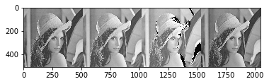

# **영상처리**

## Open Source Computer Vision

```python
import numpy as np
import matplotlib.pyplot as plt
from PIL import Image # module search
%matplotlib inline
import cv2 as cv
```


영상 및 이미지 의 색 기본은 빛의 삼원색 R,G,B로 표현(0~255)

컬러 이미지 불러들이면 (~,~,3)의 형태를 띰

```python
a = np.asarray([[0,0,0,0]
                ,[127,127,127,127]
                ,[200,200,200,200]
                ,[255,255,255,255]],dtype='uint8')
#색구현은 8비트 내에 되므로 dtype변환 -> 메모리 줄이기 위함.
plt.imshow(a,cmap='gray')
```

가시광선의 색을 모두 표현하는데 0~255 8비트 내에서 진행.

255진법이라고 생각하자

```python
b = a + 5 #overflow로 인해 255 + 5 = 4 
plt.imshow(b,cmap ='gray')
print(b)
```

색구현 시 dstack을 통해 층 3개를 사용하여 표현

그런 이유로 위에서 언급한 (~,~,3)

```python
r = np.asarray([[255,150,100,50]
                ,[0,0,0,0]
                ,[0,0,0,0]
                ,[255,150,100,50]],dtype='uint8')

g = np.asarray([[0,0,0,0]
                ,[255,150,100,50]
                ,[0,0,0,0]
                ,[255,150,100,50]],dtype='uint8')

b = np.asarray([[0,0,0,0]
                ,[0,0,0,0]
                ,[255,150,100,50]
                ,[0,0,0,0]],dtype='uint8')

colors = np.dstack([r,g,b])# 물리적으로 채널을 2개로 설정하면 컬러 색상을 표현 가능하지만 컴퓨터 상에서 가정을 할 수 없어 3 channel을 스택해서 표현해야된다
print(colors.shape) # color 영상은 항상 (,,3)으로 나타남
plt.imshow(colors)
plt.show()#overwrite###
```

이미지를 외부에서 불러오면 우리가 아는 색상으로 표현되지 않는다.

우린 RGB로 알고 있지만, BGR로 읽어오기 때문에 색상이 달라보인다.

BGR을 RGB 형태로 전환시키는 방법

> 1. 각각의 평면을 나눠 순서에 맞춰 스택하기
> 2. openCV내 cv.cvtColor('불러온 이미지',cv.COLOR_BGR2RGB)

사용에 따라서 RGB를 변환하여 다른 색 모델을 사용함.

YCrCb - 명도에 더 민감한 눈을 위해 적용. JPEG과 MPEG 등에 사용.

Green은 Black에 가장 가까운 색 흔히, 야시경도 보면 초록색으로 보이는 이유가 그 이유임

흑백 이미지 변환

``` python
celeb = cv.imread("celebrity.jpg")#default =1(칼러로 읽음)
#0은 GRAYSCALE,-1 UNCHANGED
hsv = cv.cvtColor(celeb,cv.COLOR_BGR2HSV)
#hsv(색상,채도,명도)
h = hsv[:,:,0]
s = hsv[:,:,1]
v = hsv[:,:,2]

result = celeb.copy() #값까지 복사
for r in range(h.shape[0]):
    for c in range(h.shape[1]):
        col = (int(celeb[r,c,0])+int(celeb[r,c,1])+int(celeb[r,c,2]))/3 # 합은 255을 넘어가므로 합에서부터 overflow가 나타남
        #굳이 모든 부분을 integer로 형변환 필요가 없다 왜냐하면 덧셈 연산시 자동으로 형변환이 이루어진다.
        result[r,c,0] = col;
        result[r,c,1] = col;
        result[r,c,2] = col;
        hsv = result
        
plt.imshow(hsv) #overflow가 일어남
```

얼굴 인식을 위한 변환

```python
for r in range(h.shape[0]):
    for c in range(h.shape[1]):
#         print(r,c)
        if h[r,c]>=0 and h[r,c] <= 20 :
            result[r,c,0] = people[r,c,0]
            result[r,c,1] = people[r,c,1]
            result[r,c,2] = people[r,c,2]
            mask[r,c,0]=255
            mask[r,c,1]=255
            mask[r,c,2]=255
        else:
#             col = (int(people[r,c,0])+int(people[r,c,1])+int(people[r,c,2]))/3
            result[r,c,0] = 0;
            result[r,c,1] = 0;
            result[r,c,2] = 0;
            mask[r,c,0]=0
            mask[r,c,1]=0
            mask[r,c,2]=0
all_ = np.hstack([people,mask,result])
plt.imshow(cv.cvtColor(all_,cv.COLOR_BGR2RGB))
```

binary 형태로 얼굴인식 제대로 됐는지 확인하는 작업을 한다.

색상을 통해 분석하게 될 경우 rgb 색상보다 hsv를 통해 분석하는 것이 더 뚜렷하게 나온다.

```python
train = cv.imread("patch.png")
#BGR로 이미지 분석하기
b,g,r = cv.split(train) # 슬라이싱 보다 연산이 빠른 방법

plt.hist(b.ravel(),256,[0,256],color='blue')# ravel() - 2차원 행렬을 1차원으로 변경해주는 함수
plt.hist(g.ravel(),256,[0,256],color='green')
plt.hist(r.ravel(),256,[0,256],color='red')

h,s,v = cv.split(cv.cvtColor(train,cv.COLOR_BGR2HSV)) # 슬라이싱 보다 연산이 빠른 방법
#HSV로 이미지 분석하기
plt.hist(h.ravel(),256,[0,256],color='blue')# ravel() - 2차원 행렬을 1차원으로 변경해주는 함수
plt.hist(s.ravel(),256,[0,256],color='green')
plt.hist(v.ravel(),256,[0,256],color='red')
plt.show()
```

training data는 가급적 png 사용하는 것이 좋다. (이유)

빨간색 크로마키는 없는 이유 - 사람의 얼굴은 빨간색을 띠는 부분도 있기 때문에 사용하지 않는다.

---

## 1월 7일

image의 type은 numpy.ndarray

### **Data 학습, 모델, 예측**


규칙성이 존재하지 않은 수의 나열에 다음 숫자를 예측할때 평균으로 예측하는 것이 합리적.

따라서, 통계학적 관점으로 가우시안 부포를 통해 수학적인 표현을 한다.

영상밝기변화 overwrite 방지 위한 2가지 방법

클래핑 기법

0이하의 값은 0으로, 255 이상의 값은 255로 결과값 리턴

>  ```python
> np.array(image,dtype='int')#int변환
> image.astype(np.int)#int변환2
> np.clip(연산값, min_value ,max_value)#clip함수 처리
> np.array(image,dtype='uint8')#다시 4바이트로 변환
> image.astype(np.uint8)#다시 4바이트로 변환2
>  ```
>
> 



랩핑 기법


> ```py
> 
> ```
>
> 

LUT(LookUpTable) 테이블을 통해 선형 비선형 변환 문제를 다 처리할 수 있음.

> ```python
> def addlut(op) : 
>     return [x+op if x+op<255
>             else 255 for x in range(256)] # list객체에선 type이 int32로 나오므로 np.array를 하고 astype('uint8')로 형변환 해준다
> def mullut(op) : 
>     return np.array([x*op if x*op<255 else 255 
>                      for x in range(256)]).astype('uint8')
> def binlut(op) : 
>     return np.array([ 255 if x>=op else 0 
>                      for x in range(256)]).astype('uint8')
> def binlut(op) : 
>     return np.array([ (x>op)*255 
>                      for x in range(256)]).astype('uint8')
> def invlut(op) : 
>     return np.array([ 255-x  
>                      for x in range(256)]).astype('uint8')
> def poslut(op) : 
>     return np.array([int(x/op)*op
>                      for x in range(256)]).astype('uint8')
> # cv.LUT(image,lut_function)
> ```
>
> 

이와 같이 다양한 함수 설정으로 이미지를 변환 시킬 수 있음

또한 이미지 크기와는 상관없이 연산을 하기 때문에 LUT 연산하면 numpy 연산 속도 보존

3d lut 또한 조절 가능하다.

LUT는 전력 소모가 거의 없다.

사진에 한글 작성시 ImageFont.truetype

### 화소 영역 처리

화소의 원값이나 위치를 바탕으로 화소 변경 처리와 달리 해당 입력 화소 뿐 아니라 주위 화소 값도 고려하는 공간 영역 연산

컨볼루션 기법으로 수행함.

회선 마스크 1 -1의 의미 -  미분을 하겠다

mean() blurring을 위한 회선 마스크(low pass filter) - 고주파 성분을 제거하는데 사용

sharpening을 위한 회선 마스크(high pass filter) - 저주파 성분을 제거하는데 사용

경계선 영역 - 밝기값이 급격하게 변하는 부분(sum = 0 )

sum = 1 -> null mask

가우시안 필터 처리 하는 이유 - 노이즈를 제거하는 


----

## 1월 8일


**데이터 표현**

다차원 데이터는 위치 정보가 중요하다.

filtered2D를 통해 진행시킬때 padding 된 값은 reflection 101 값으로 나타난다.

dimension이 증가하면 overfitting 문제가 생긴다.

kernel 로 filtering 된 값들은 기본적으로 클립핑이 된 형태로 나타난다.

기본적으로 클립핑이 일어나 물리적인 값과 논리적인 값이 다르게 나타남

따라서 영상 분석을 하는데, 정규화 과정을 통해 표현을 할 수 있도록 한다.

```python
np.ptp(자료) # max-min
```

2차 미분을 이용한 에지 검출


**센서**

값들을 양자화시켜 인식함.

양자화를 시키는데 있어 반올림을 하여 표현하기 때문에 오차가 심하게 나타나기도 함.

---

## **1월 9일**

binary threshhold(THRESH_BINARY) / OTSU(THRESH_OTSU)

```python
threshold,mask = cv.threshold(image,threshold_value,converted_value,method)
# method = binary , otsu etc.
cv.GaussianBlur(image,(kernel_size),std)
#std = softness
cv.adaptiveThreshold(image, )
cv.findContours(image,method)
#method(cv.RETR_EXTERNAL,cv.CHAIN_APPROX_SIMPLE)
cv.drawContours(image,contours,)
```


adaptiveThreshold() ADAPTIVE_THRESH_GAUSSIAN_C

morphologyEx / MORPH_OPEN

findContours

drawContours